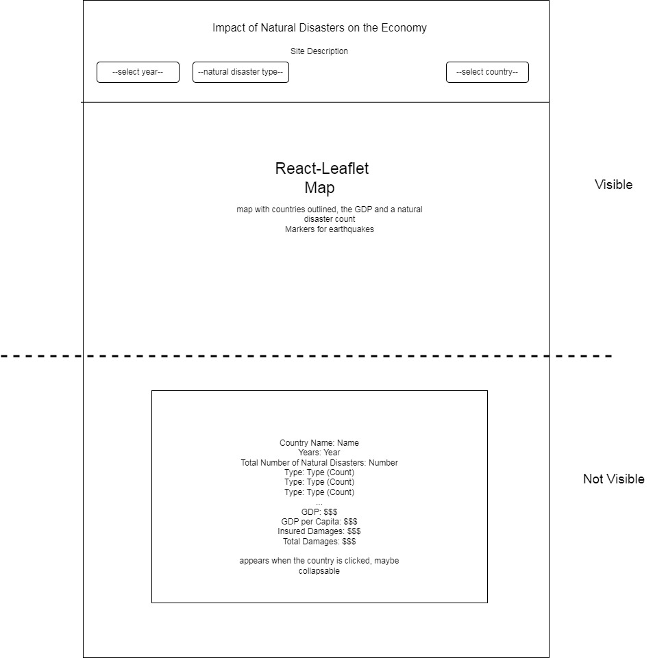

# Impact of Natural Disaster on the Economy

## Data

Natural disasters from 1970-2022 and World, Region, Country GDP/GDP per capita in USD from 1960-2021

https://gitlab.com/csy3dawson23-24/520/teams/TeamF13-SilaSimonaVasilii/520-project-benkhelifa-dragomir-iurev/-/issues/1

## API

1. GET /api/v1/:year/natural-disasters/country/:country?type=
2. GET /api/v1/:year/natural-disasters/type/:type
3. GET /api/v1/:year/gdp?country=
4. GET /api/v1/:year/gdp-per-capita?country=

World, Region, Country GDP/GDP per capita(Country Name, Year, GDP_USD, *GDP_per_capita_USD)
ALL NATURAL DISASTERS (Year, Disaster Type, Country, Latitude, Longitude, Insured Damages ('000 US$), Total Damages ('000 US$))

## Visualizations

An interactive map will be used to present differences in GDP per capita in different countries, as well as natural disasters. Users will be able to select a year and see data visualization. 

## Views

Above the fold, the app will have the controls for data filters, and the map taking up the whole screen width.

Below the fold, detailed information about the selected country will be shown, such as the number of natural disasters occured and GDP/GDP per capita values. Additionally, we might implement displaying the complete list of Natural Disaster for the country/year selected.

## Functionality

Users will be able to filter data based on the following criteria:

* Year
* Type of Natural Disaster
* Country

In addition to those filters, it will be possible for users to move the map, and zoom in and out on different parts of the world. When moving and zooming in/out on the map, the data presented will update dynamically to show relevant and readable information about the specific region.

## Features and Priorities

### Core Features

* Interactive map
* Data filters
* Markers for earthquakes
* Detailed information about a specific Natural Disaster on the map
* Display the number of Natural Disaster occured in the selected country

### Additional Features

* More data filters for Natural Disasters
* More types of Natural Disasters presented as markers on the map
* UI tweaks: make the list of Natural Disasters collapsable, make year selection into a timeline slider.

## Dependencies

React Leaflet Map will be used to display a map with clickable markers, popups, coloured layers
